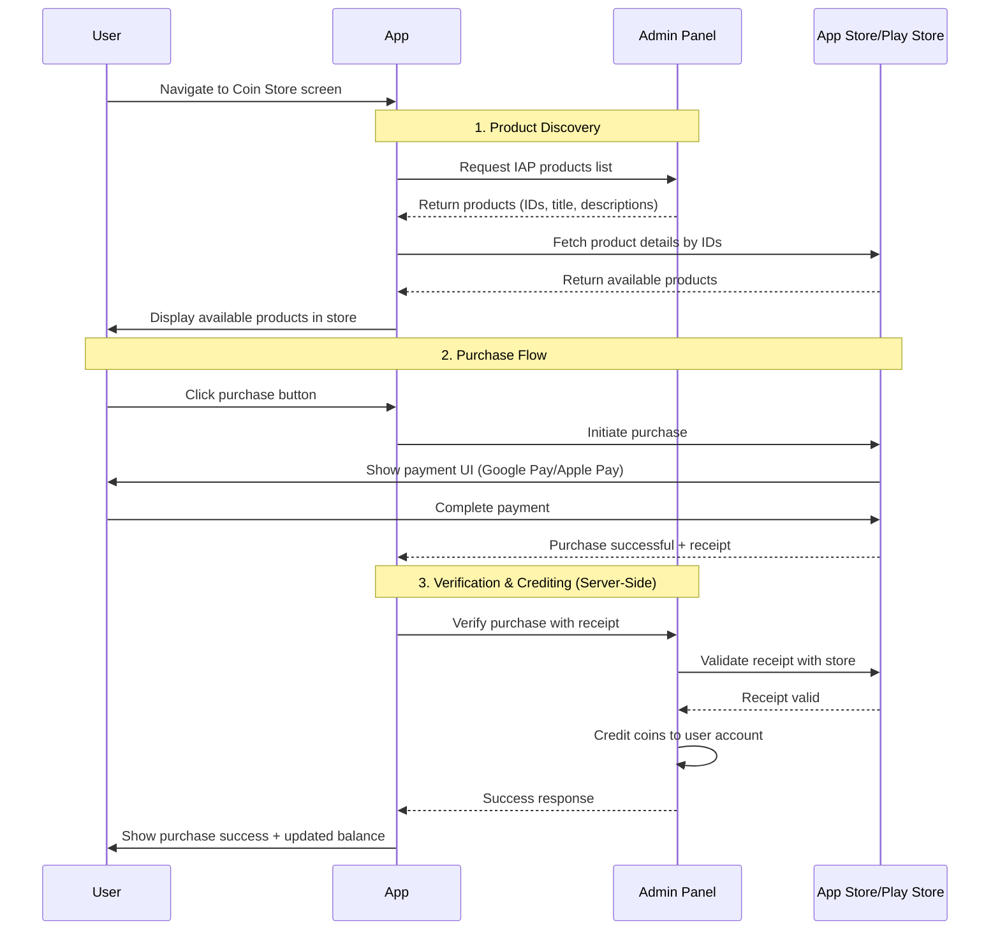

# Configure In‑App Purchases

## Overview

Elite Quiz supports:

- Purchasing virtual coins using in‑app purchases (IAP)
- A one‑time, lifetime "Remove Ads" non‑consumable purchase

::::warning Prerequisites
Before proceeding with this guide, please kindly read the [WRTeam Common IAP Documentation](https://wrteam-in.github.io/common_app_doc/GeneralSettings/iap) to understand:

- How to create In-App Purchases in **App Store** and **Play Console**
- Different types of IAP (consumable, non-consumable)
- IAP testing procedures and requirements
- Platform-specific guidelines and restrictions

This foundational knowledge is essential because this page focuses only on Elite Quiz–specific configuration.
::::

:::note
Subscriptions are not currently supported.
:::

## How In-App Purchases Work

Understanding the IAP flow helps ensure proper setup and troubleshooting. Here's the complete purchase lifecycle:

### Key Security Features

- **Server-Side Verification**: All purchases are validated with the respective app stores before crediting coins
- **Secure Coin Crediting**: Coins are added to user accounts on the server side, preventing client-side manipulation
- **Receipt Validation**: Every purchase receipt is verified with Google Play or Apple's servers before acceptance

## Create In‑App Purchases in the Admin Panel

1. Open the Admin Panel and go to `Settings > Coin Store Settings`.
2. Create your coin packs and the remove‑ads product.
   - Coin packs are consumable purchases.
   - Remove Ads is a non‑consumable, lifetime purchase. Only one remove‑ads product is allowed.

Examples:

- 100 Coins (consumable)

  - Name: 100 Coins
  - Coins: 100
  - Product ID: `appname_consumable_100_coins` (must be unique and consistent across both stores)
  - Description: Buy 100 Coins
  - Image: Select an appropriate icon

- Remove Ads (non‑consumable)
  - Type: Ads
  - Pricing: Choose a one‑time price (lifetime entitlement)
  - Only one Ads‑type product is supported

Notes:

- Items you create here will not appear in the app until you also create matching products in the app stores and complete testing/approval.
- Create all the packages you want first; you will connect them to store products next.

## Platform-Specific Configuration

Before creating IAP products in the App Stores, ensure you have completed these platform-specific configurations:

### Android Specific

#### Step 1: Add your Android package name in the Admin Panel

- Go to your `Admin Panel > Settings > In App Settings`
- Add your android app package name in

#### Step 2: Add your Firebase service account email to Google Play Console for purchase validation

#### Step 3: Enable "Google Play Android Developer API" in Google Play Console

### iOS Specific

#### Step 1: Create and add the shared secret from App Store Connect to your Admin Panel

## Implementation Workflow

### Step 1: Create IAP Products in Admin Panel

Configure your in-app purchase products in the Elite Quiz Admin Panel:

- Set up coin packages with appropriate quantities and pricing
- Configure the "Remove Ads" non-consumable product
- Define product IDs that will be used across all platforms
- Test the admin panel IAP configuration

### Step 2: Create Matching Products in App Stores

Create identical IAP products in both Google Play Console and Apple App Store Connect:

- **Product IDs must match exactly** between platforms and admin panel
- Use consistent naming, descriptions, and pricing
- Ensure proper product types (consumable for coins, non-consumable for remove ads)
- Configure appropriate price tiers for different markets
- Wait for products to be approved and available for testing

### Step 3: Testing and Validation

Deploy your app for testing and validate IAP functionality:

- **Android Testing**: Use closed/open/internal testing tracks on Google Play
- **iOS Testing**: Deploy to TestFlight for iOS testing
- **Test User Setup**: Configure license testing for Android and sandbox users for iOS
- **Purchase Flow Testing**: Verify complete purchase workflows work correctly
- **Entitlement Validation**: Confirm coins are credited and remove‑ads entitlement persists across reinstalls

::::warning Testing Requirements
IAP testing requires your app to be published in testing tracks (Google Play) or TestFlight (iOS). Local development testing of purchases is not possible without proper app store distribution.
::::

---

## Important Notes

- **Product ID Consistency**: All product IDs must be identical across Admin Panel, Google Play, and App Store
- **Testing Timeline**: Allow extra time for app store review processes during testing phases
- **Purchase Validation**: Elite Quiz includes server-side purchase validation for security
- **Regional Pricing**: Consider local market pricing when setting IAP costs
- **Data Propagation**: New or updated IAPs can take time to propagate; if a product does not appear, wait and retry

::::tip Success Factors
Successful IAP implementation requires careful attention to product ID consistency, thorough testing across both platforms, and proper server-side validation. Take time to test thoroughly before production release.
::::

---

## Frequently Asked Questions

### General Setup

#### Why don't my IAP products appear in the app?

This is usually caused by one of these issues:

1. **Product ID Mismatch**: The product IDs in Admin Panel don't exactly match those in App Store Connect/Play Console

   - Solution: Verify IDs are identical (case-sensitive) across all platforms

2. **Products Not Approved**: Store products are still in draft or pending review

   - Solution: Ensure products are approved and available for testing/production

3. **App Not Properly Signed**: Using wrong build configuration or signing certificate

   - Solution: For Android, use the same signing key as your Play Console app. For iOS, ensure proper provisioning profiles

4. **Propagation Delay**: Recent changes haven't propagated through store systems
   - Solution: Wait 1-2 hours and retry, or clear app data and reinstall

#### Do I need to create the same products three times?

Yes, but they serve different purposes:

1. **Admin Panel**: Defines the products and their reward values (coins, ad removal)
2. **Google Play Console**: Handles Android payment processing and pricing
3. **App Store Connect**: Handles iOS payment processing and pricing

The **product IDs must be identical** across all three platforms for the system to work correctly.

### Testing

#### How do I test purchases without spending real money?

**Android**:

- Add test accounts in Google Play Console under "License testing"
- Use internal testing, closed testing, or open testing tracks
- Test users will see a "Test purchase" label and won't be charged

**iOS**:

- Create sandbox tester accounts in App Store Connect
- Sign out of your real Apple ID on the device
- When prompted during purchase, sign in with sandbox account
- Sandbox purchases are free and can be repeated

:::warning
Always test IAP on real devices, not simulators/emulators. IAP testing requires actual app store connectivity.
:::

#### Can I test IAP locally during development?

No. IAP testing requires:

- App to be uploaded to app stores (even in testing tracks)
- Proper signing and provisioning
- Test accounts configured in respective store consoles

Local development builds cannot process real or test payments.

### Troubleshooting Purchases

#### User completed payment but didn't receive coins. What happened?

This typically indicates a verification failure. Check these in order:

1. **Platform-Specific Configuration**

   - **Android**: Verify Firebase service account email is added to Play Console with proper permissions
   - **Android**: Ensure "Google Play Android Developer API" is enabled
   - **iOS**: Verify the shared secret from App Store Connect is correctly added to Admin Panel

2. **Network Issues**: Verification request to Admin Panel may have failed

   - Check server logs for verification requests
   - Ensure Admin Panel is accessible from user's network

3. **Receipt Validation Failure**: Admin Panel couldn't validate receipt with store

   - Verify platform-specific API credentials are correct
   - Check Admin Panel logs for validation errors

4. **Purchase Already Processed**: Duplicate receipt submission
   - Stores may resend receipts; Admin Panel should handle duplicates gracefully

:::tip Recovery
Most IAP libraries have purchase restoration features. Users can try:

1. Force-close and restart the app
2. Use "Restore Purchases" button if available
3. Contact support with their transaction ID
   :::

#### "Product not found" error when user tries to purchase

**Checklist**:

- [ ] Product exists and is approved in the correct store (Play/Apple)
- [ ] Product ID in Admin Panel exactly matches store product ID
- [ ] App is using the same package name (Android) or bundle ID (iOS) as configured in stores
- [ ] For Android: App is signed with the correct key
- [ ] Recent product changes have propagated (wait 1-2 hours)

#### Purchase verification taking too long or timing out

**Possible causes**:

1. **Admin Panel Performance**: Server overloaded or slow database queries

   - Solution: Optimize server resources, check database indexes

2. **Store API Latency**: Google/Apple's verification APIs are slow

   - Solution: Implement timeout handling and retry logic

3. **Network Connectivity**: Poor connection between app, Admin Panel, or store APIs

   - Solution: Show loading state, allow users to retry

4. **Firebase Service Account Issues** (Android only): Invalid or expired credentials
   - Solution: Regenerate and re-upload service account credentials

### Platform-Specific Issues

#### Android: "The item you requested is not available for purchase"

**Common causes**:

- App not published to any testing track
- Testing account not added to license testing list
- Product not activated in Play Console
- Wrong package name in app configuration

**Solution**:

1. Ensure app is in at least internal testing track
2. Add test account to Play Console license testing
3. Verify product status is "Active" in Play Console

#### iOS: "Cannot connect to iTunes Store"

**Common causes**:

- Not using a sandbox account for testing
- Sandbox account signed in to production App Store
- Product not submitted for review or approved
- App not distributed via TestFlight

**Solution**:

1. Sign out of production Apple ID completely
2. Use TestFlight build, not local debug build
3. When prompted, sign in with sandbox account
4. Ensure products are "Ready to Submit" or approved

#### iOS: Shared Secret errors

**Symptoms**: Purchases complete but verification fails

**Solution**:

1. Go to App Store Connect → Apps → Your App → App Information
2. Copy the App-Specific Shared Secret (not Master Shared Secret)
3. Add to Admin Panel under iOS IAP settings
4. Ensure no extra spaces or characters in the secret

### Remove Ads Purchase

#### User purchased "Remove Ads" but still sees ads

**Troubleshooting steps**:

1. **Verify Purchase Verification Succeeded**: Check Admin Panel user account shows remove-ads entitlement

2. **App Not Checking Entitlement**: App may not be querying remove-ads status correctly

   - Solution: Ensure app checks entitlement on startup and before showing ads

3. **Entitlement Not Persisting**: User data not syncing correctly

   - Solution: Force sync user data from Admin Panel or restore purchases

4. **Cache Issues**: Old ad configuration cached
   - Solution: Clear app cache/data and restart

#### Remove Ads purchase not restoring on new device

Non-consumable purchases (like Remove Ads) should be restorable:

1. Ensure app implements purchase restoration
2. User should use "Restore Purchases" option in app settings
3. User must be signed in with the same Apple ID/Google account used for original purchase

### Coins and Consumables

#### Can users request refunds for coin purchases?

Yes, users can request refunds through their respective app stores:

- **Google Play**: Users can request refund within 48 hours via Play Store app
- **Apple App Store**: Users can request refund via reportaproblem.apple.com

:::warning
When stores issue refunds:

- You may receive a notification from the store
- You should revoke the purchased coins from the user's account
- Implement server-side refund handling to prevent abuse
  :::

#### How do I handle fraudulent purchases?

**Prevention**:

- Elite Quiz already implements server-side verification (good!)
- Monitor for unusual purchase patterns (same user, many purchases, immediate refunds)
- Implement rate limiting on purchases

**Detection**:

- Review store refund notifications regularly
- Check for users with negative coin balances (after refund)
- Monitor Admin Panel logs for verification failures

**Response**:

- Deduct refunded coins from user accounts
- Consider flagging or banning accounts with multiple fraudulent attempts
- Report egregious abuse to app stores

---

## Still Having Issues?

If you're experiencing IAP issues not covered here:

1. **Check Platform Documentation**: Review the [WRTeam Common IAP Documentation](https://wrteam-in.github.io/common_app_doc/GeneralSettings/iap)
2. **Review Server Logs**: Check Admin Panel logs for verification errors
3. **Test Methodically**: Isolate the issue (Android vs iOS, specific products, all users vs specific users)
4. **Contact Support**: Provide detailed information including platform, product IDs, error messages, and server logs
