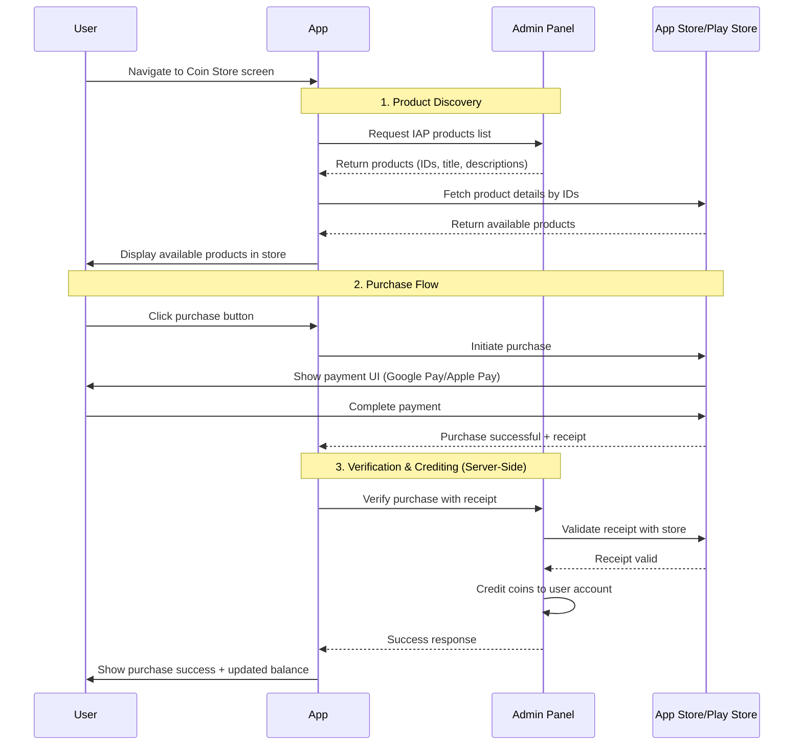

# Configure In‑App Purchases

## Overview

Elite Quiz supports:

- Purchasing virtual coins using in‑app purchases (IAP)
- A one‑time, lifetime "Remove Ads" purchase

:::warning Prerequisites
Before proceeding with this guide, please read the [WRTeam Common IAP Documentation](https://wrteam-in.github.io/common_app_doc/GeneralSettings/iap) to understand:

- How to create In-App Purchases in **App Store** and **Play Console**
- Different types of IAP (consumable, non-consumable)
- IAP testing procedures and requirements
- Platform-specific guidelines and restrictions

This foundational knowledge is essential because this page focuses only on Elite Quiz–specific configuration.
:::

:::note
Subscriptions are not currently supported.
:::

  
<strong>Quick Start Checklist (For Experienced Users)</strong>

- [ ] Create IAP products in Admin Panel (`Settings > Coin Store Settings`)
- [ ] **Android**: Add package name to Admin Panel
- [ ] **Android**: Add Firebase service account to Play Console with admin permissions
- [ ] **Android**: Enable Google Play Android Developer API
- [ ] **iOS**: Add App Store Connect shared secret to Admin Panel
- [ ] Create matching products in Play Console and App Store Connect with identical IDs
- [ ] Upload app to testing tracks and test purchases

## How In-App Purchases Work

Understanding how IAP works helps you set up correctly and fix problems. Here's what happens when a user buys coins:

### Key Security Features

- **Server-Side Verification**: All purchases are validated with the app stores before giving coins to users
- **Secure Coin Crediting**: Coins are added on the server side, so users cannot cheat the system
- **Receipt Validation**: Every purchase is verified with Google Play or Apple's servers before acceptance

---

## Step 1: Create Products in Admin Panel

1. Open the Admin Panel and go to `Settings > Coin Store Settings`
2. Create your coin packs and remove-ads product

**Product Types:**

- **Coin Packs**: Consumable purchases (users can buy multiple times)
- **Remove Ads**: Non-consumable, lifetime purchase (users buy once, keep forever)

:::note Pricing
You will set the actual prices later in Google Play Console and App Store Connect, not in the Admin Panel. The Admin Panel only defines what users receive (coins or ad removal).
:::

### Example: 100 Coins Pack (Consumable)

- **Name**: 100 Coins
- **Coins**: 100
- **Product ID**: `elitequiz_consumable_100_coins`
  - Replace `elitequiz` with your app name
  - Must be **exactly the same** in Admin Panel, Play Console, and App Store Connect
  - Use only lowercase letters, numbers, and underscores
- **Description**: Buy 100 Coins
- **Image**: Upload an icon for this product

### Example: Remove Ads (Non-Consumable)

- **Type**: Ads
- **Product ID**: `elitequiz_remove_ads`
  - Replace `elitequiz` with your app name
  - Must be **exactly the same** across all platforms
- **Description**: Remove all advertisements
- **Note**: You can only create one Remove Ads product

:::warning Important
Products you create in the Admin Panel will **not** appear in your app until you also create matching products in Google Play Console and App Store Connect with **identical Product IDs**.
:::

---

## Step 2: Platform-Specific Configuration

Before creating products in app stores, complete these platform-specific setup steps:

### Android Configuration

#### Step 1: Add Your Android Package Name

1. Go to `Admin Panel > Settings > In-App Settings`
2. Enter your Android app package name in the `App Package Name` field
   - Example: `com.yourcompany.elitequiz`
   - This must match the package name in your Android app

#### Step 2: Connect Firebase to Play Console

This allows the Admin Panel to verify purchases with Google Play.

1. In Admin Panel, go to `Settings > In-App Settings`
2. Copy the **Firebase Client Email** (shown in the settings)

3. Open [Google Play Console](https://play.google.com/console/u/0/developers/_/app-list)
4. Go to `Users and permissions`
5. Click `Invite new users`
6. Paste the Firebase Client Email you copied
7. In the `Permissions` section, click `Add App` under the `App permissions` tab
8. Select your app and click `Apply`
9. Select `Admin (all permissions)` and click `Apply`
10. Click `Invite user`

**Watch the video guide:**

<iframe
  width="100%"
  height="500"
  style={{ borderRadius: '10px', border: 'none' }}
  src="https://www.youtube.com/embed/vfIiAUhwXrY"
  title="Add Firebase Client Email to Play Console"
  allow="accelerometer; autoplay; clipboard-write; encrypted-media; gyroscope; picture-in-picture"
  allowFullScreen>
</iframe>

#### ⏱️ Important: Wait Time Required

Google Play needs time to process these permission changes. This is normal.

- **Minimum wait**: 2-4 hours
- **Maximum wait**: Up to 24 hours (in rare cases)

If IAP doesn't work immediately after setup:

1. Wait 2-4 hours, then test again
2. If still not working, wait up to 24 hours
3. Clear your app cache and reinstall before testing

Most setups work within 4 hours.

#### Step 3: Enable Google Play Android Developer API

1. Go to [Google Cloud Console](https://console.cloud.google.com)
2. Make sure the correct Firebase project is selected (check the top dropdown)
3. Click this link to enable the API: [Enable Google Play Android Developer API](https://console.cloud.google.com/marketplace/product/google/androidpublisher.googleapis.com)
4. Click the `Enable` button

#### Step 4: Upload App for Testing

1. Upload your app to Google Play Console in any testing track (Internal, Closed, or Open Testing)
2. Wait for Google to review your app (this usually takes a few hours)
3. Once reviewed, add your email to `License Testing` to test purchases without paying real money

---

### iOS Configuration

#### Step 1: Get the Shared Secret from App Store Connect

The shared secret allows the Admin Panel to verify iOS purchases with Apple.

1. Open [App Store Connect](https://appstoreconnect.apple.com)
2. Click on your app
3. Go to `App Information` (in the left sidebar under `General`)
4. Scroll down to the `App-Specific Shared Secret` section
5. Click `Manage` or `Generate` if you don't have one yet
6. Copy the shared secret code

:::warning Use App-Specific Shared Secret
Make sure you copy the **App-Specific Shared Secret**, not the Master Shared Secret. The app-specific version is more secure.
:::

#### Step 2: Add Shared Secret to Admin Panel

1. Go to `Admin Panel > Settings > In-App Settings`
2. Find the `iOS Shared Secret` field
3. Paste the shared secret you copied from App Store Connect
4. Click `Save`

:::tip Double-Check for Errors
Make sure there are no extra spaces at the beginning or end of the shared secret. Extra spaces will cause verification to fail.
:::

#### Step 3: Upload App to TestFlight

1. Build your iOS app in Xcode
2. Upload to App Store Connect
3. Submit to TestFlight
4. Wait for Apple to process your build (usually 30-60 minutes)
5. Add testers in TestFlight to test purchases

:::warning Testing Requirements
In-app purchase testing requires your app to be distributed through official channels:

- **Android**: App must be uploaded to Google Play Console in a testing track
- **iOS**: App must be distributed via TestFlight

You **cannot** test IAP in local development builds or emulators. You must use real devices with apps installed from the stores.
:::

---

## Step 3: Create Products in App Stores

Now create matching products in Google Play Console and App Store Connect.

:::tip Product ID Consistency
The most important rule: **Product IDs must be exactly identical** across:

- Admin Panel
- Google Play Console
- App Store Connect

Product IDs are case-sensitive. `elitequiz_100_coins` is different from `EliteQuiz_100_Coins`.
:::

### Create Products in Google Play Console

1. Open [Google Play Console](https://play.google.com/console)
2. Select your app
3. Go to `Monetize > In-app products`
4. Click `Create product`
5. Enter the **exact same Product ID** you used in Admin Panel
6. Set your price (this is where you set the actual price users will pay)
7. Add title, description, and save
8. Click `Activate` to make the product available

### Create Products in App Store Connect

1. Open [App Store Connect](https://appstoreconnect.apple.com)
2. Select your app
3. Go to `Features > In-App Purchases`
4. Click `+` to create a new product
5. Choose type: `Consumable` (for coins) or `Non-Consumable` (for remove ads)
6. Enter the **exact same Product ID** you used in Admin Panel
7. Set your price tier (this is where you set the actual price users will pay)
8. Add reference name, display name, and description
9. Click `Save`

---

## Step 4: Test Your Setup

### Android Testing

1. **Add Test Account**:

   - In Play Console, go to `Setup > License testing`
   - Add your Gmail address to the list of license testers

2. **Install and Test**:
   - Install the app from the testing track on a real Android device
   - Sign in with your test Gmail account
   - Go to the coin store in the app
   - Try purchasing a product
   - You'll see "Test purchase" and won't be charged real money

### iOS Testing

1. **Create Sandbox Account**:

   - In App Store Connect, go to `Users and Access > Sandbox Testers`
   - Click `+` and create a test account with a unique email

2. **Test on Device**:
   - On your iOS device, sign out of your regular Apple ID
   - Install the app from TestFlight
   - When you try to purchase, iOS will ask you to sign in
   - Sign in with your sandbox tester account
   - Complete the purchase (it's free in sandbox mode)

:::warning Use Real Devices
Always test on real devices (real Android phone or iPhone). IAP **does not work** on emulators or simulators.
:::

---

## Important Notes

- **Product ID Consistency**: All product IDs must be identical across Admin Panel, Google Play, and App Store
- **Testing Timeline**: Allow time for app store review processes during testing (2-4 hours for Android permissions, 30-60 minutes for iOS builds)
- **Purchase Validation**: Elite Quiz includes server-side purchase validation for security
- **Data Propagation**: New or updated products can take 1-2 hours to appear in apps; if a product doesn't appear, wait and try again

---

## Frequently Asked Questions

### General Setup

#### Why don't my IAP products appear in the app?

This is usually caused by one of these issues:

1. **Product ID Mismatch**: The Product IDs don't match exactly

   - **Solution**: Check that Product IDs are identical (including capital/lowercase letters) in Admin Panel, Play Console, and App Store Connect

2. **Products Not Approved**: Store products are still in draft or pending review

   - **Solution**: Make sure products are approved and active in both app stores

3. **App Not Properly Signed**: Using the wrong build or certificate

   - **Solution (Android)**: Use the same signing key as your Play Console app
   - **Solution (iOS)**: Make sure you're using the correct provisioning profile

4. **Store Delay**: Recent changes take time to update
   - **Solution**: Wait 1-2 hours, then clear app data and reinstall

#### Do I need to create the same products three times?

Yes, you create products in three places, but each serves a different purpose:

1. **Admin Panel**: Defines what users get (100 coins, remove ads, etc.)
2. **Google Play Console**: Handles Android payments and sets Android prices
3. **App Store Connect**: Handles iOS payments and sets iOS prices

The **Product ID must be identical** in all three places so the system knows they're the same product.

### Testing

#### How do I test purchases without spending real money?

**Android**:

- Add your email to "License testing" in Play Console
- Install from a testing track (Internal/Closed/Open Testing)
- When you purchase, you'll see "Test purchase" and won't be charged

**iOS**:

- Create a sandbox tester account in App Store Connect
- Sign out of your real Apple ID on your device
- Install from TestFlight
- When purchasing, sign in with the sandbox account
- Sandbox purchases are free

:::warning Test on Real Devices
IAP testing **only works on real devices**, not emulators or simulators. You need actual app store connectivity.
:::

#### Can I test IAP locally during development?

No. IAP testing requires:

- App uploaded to app stores (even in testing tracks)
- Proper signing and certificates
- Test accounts configured in app store consoles

Local development builds cannot process purchases (real or test).

### Troubleshooting Purchases

#### User completed payment but didn't receive coins. What happened?

This usually means the purchase verification failed. Check these in order:

1. **Check Platform Configuration**:

   - **Android**: Is Firebase service account email added to Play Console with admin permissions?
   - **Android**: Is "Google Play Android Developer API" enabled in Google Cloud?
   - **iOS**: Is the shared secret correctly added to Admin Panel?

2. **Check Network Connection**:

   - The Admin Panel must be able to connect to the internet to verify purchases
   - Check Admin Panel server logs for errors

3. **Check Receipt Validation**:
   - Look in Admin Panel logs for validation errors
   - Make sure API credentials are correct

#### "Product not found" error when trying to purchase

**Checklist**:

- [ ] Product exists and is approved in the correct store (Play Console or App Store Connect)
- [ ] Product ID in Admin Panel **exactly matches** the Product ID in the store (check for typos)
- [ ] App package name (Android) or bundle ID (iOS) matches what's configured in stores
- [ ] For Android: App is signed with the correct signing key
- [ ] Recent product changes have had time to propagate (wait 1-2 hours)

### Platform-Specific Issues

#### Android: "The item you requested is not available for purchase"

**Common causes**:

- App not uploaded to any testing track
- Your email not added to license testing list
- Product not activated in Play Console
- Wrong package name in app settings

**How to fix**:

1. Make sure app is in at least Internal Testing track
2. Add your email to Play Console license testing
3. Check that product status is "Active" in Play Console
4. Verify package name matches between app and Admin Panel

#### iOS: "Cannot connect to iTunes Store"

**Common causes**:

- Not using a sandbox tester account
- Signed in to regular App Store instead of sandbox
- Product not submitted or approved
- Not using TestFlight build

**How to fix**:

1. Sign out of your regular Apple ID completely
2. Use a TestFlight build, not a local development build
3. When prompted during purchase, sign in with sandbox tester account
4. Make sure products are "Ready to Submit" or approved in App Store Connect

#### iOS: Shared Secret errors

**Symptoms**: Purchases complete but verification fails

**How to fix**:

1. Go to App Store Connect → Your App → App Information
2. Copy the **App-Specific Shared Secret** (not Master Shared Secret)
3. Add it to Admin Panel under `Settings > In-App Settings`
4. Make sure there are no extra spaces at the beginning or end

### Remove Ads Purchase

#### User purchased "Remove Ads" but still sees ads

**Troubleshooting steps**:

1. **Check if purchase verified**: Look in Admin Panel to see if the user has the remove-ads entitlement

2. **App not checking status**: The app might not be checking if ads should be hidden

   - Make sure the app checks remove-ads status when it starts and before showing ads

3. **User data not syncing**: User account data might not be up to date

   - Force sync user data from Admin Panel, or ask user to restore purchases

4. **Cached data**: Old settings might be cached
   - Clear app cache/data and restart the app

### Coins and Consumables

#### Can users request refunds for coin purchases?

Yes, users can request refunds through the app stores:

- **Google Play**: Users can request refund within 48 hours through the Play Store app
- **Apple App Store**: Users can request refund at [reportaproblem.apple.com](https://reportaproblem.apple.com)

:::warning Handle Refunds
When a store issues a refund:

- You may receive a notification from the store
- You should remove the refunded coins from the user's account to prevent abuse
  :::

#### How do I handle fraudulent purchases?

**Prevention**:

- Elite Quiz already uses server-side verification (this prevents most fraud)
- Watch for unusual patterns (same user making many purchases then getting refunds)
- Consider adding purchase rate limits

**Detection**:

- Check store refund notifications regularly
- Look for users with negative coin balances (happens after refunds)
- Review Admin Panel logs for verification failures

**Response**:

- Remove refunded coins from user accounts
- Consider banning accounts with multiple fraudulent attempts
- Report serious abuse to the app stores

---

## Still Having Issues?

If you're experiencing IAP problems not covered here:

1. **Check Platform Documentation**: Review the [WRTeam Common IAP Documentation](https://wrteam-in.github.io/common_app_doc/GeneralSettings/iap)
2. **Review Server Logs**: Check Admin Panel logs for verification errors
3. **Test Methodically**: Isolate the issue (Android vs iOS? Specific products? All users or just some?)
4. **Contact Support**: Provide detailed information including:
   - Platform (Android or iOS)
   - Product IDs
   - Error messages
   - Server logs
