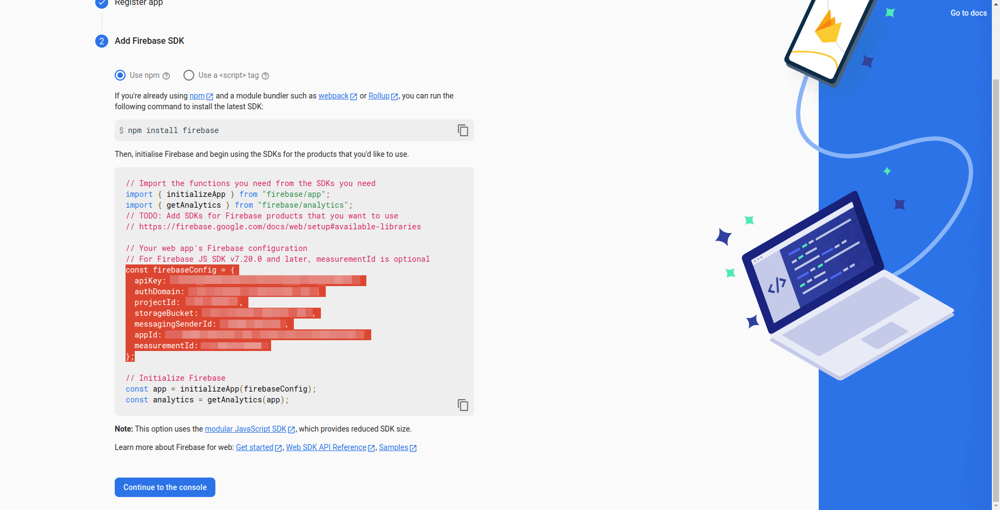

# Enhanced Documentation Styling

This page demonstrates the improved styling for images and code blocks in the Elite Quiz documentation.

## Images with Enhanced Styling

Images now have a beautiful shadow effect and hover animation:


## Code Blocks with File Names

Code blocks now support file name display and improved syntax highlighting:

```env title=".env"
# Admin URL
NEXT_PUBLIC_ADMIN_URL="https://elitequiz.wrteam.in"

# Website URL
NEXT_PUBLIC_APP_WEB_URL="https://elitequiz.wrteam.in"

# End point (do not change this key)
NEXT_PUBLIC_END_POINT="/api/"

# Default Country
# Here you get default country list (https://developers.google.com/maps/documentation/javascript/reference/places-autocomplete-service#ComponentRestrictions)
# Enter in small letters eg:- "in" to filter code -> "in"
NEXT_PUBLIC_DEFAULT_COUNTRY ="in"

# Seo (do not change this value)
NEXT_PUBLIC_SEO = "false"

# Import element disabled
NEXT_PUBLIC_INSPECT_ELEMENT = "false"

# Meta static
NEXT_PUBLIC_META_TITLE = "No. 1 Trivia Quiz Script on CodeCanyon|Play, Learn, and Win!"
NEXT_PUBLIC_META_DESCRIPTION = "Explore the best trivia quiz web on Codecanyon, featuring multiple quiz types to challenge your knowledge. ELITE QUIZ:Quiz,Question/Answer,ONLINE QUIZ"
NEXT_PUBLIC_META_KEYWORDS = "Quiz,Trivia,Quiz competition,Quiz Gaming Platform,Quiz Script"
```

## Firebase Configuration Example

Here's an example of how Firebase configuration is displayed:

```js title="firebase-config.js"
const firebaseConfig = {
  apiKey: "YOUR_API_KEY",
  authDomain: "your-app.firebaseapp.com",
  projectId: "your-project-id",
  storageBucket: "your-app.appspot.com",
  messagingSenderId: "123456789",
  appId: "1:123456789:web:abcdef123456",
  measurementId: "G-ABCDEF123",
};

export default firebaseConfig;
```

## Configuration Steps with Images

Configuration steps are now more visually appealing:

1. First, add your admin panel URL in the `.env` file

   

2. Then configure your Firebase project settings

   

3. Finally, set up authentication methods

   
