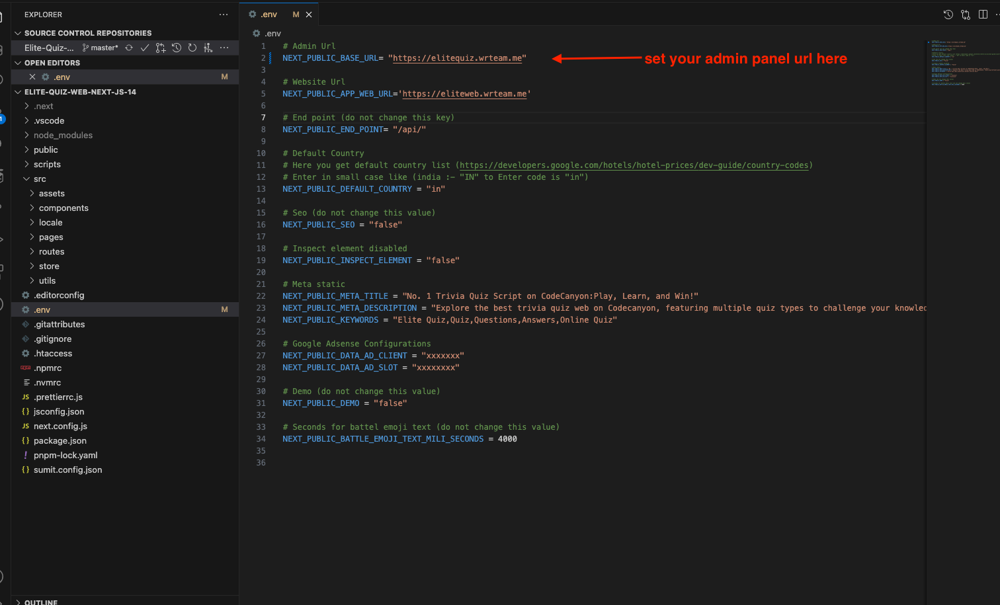

# API URL Configuration

## Where to Set API URL (Admin)

1. Go to the main folder and open the `.env` file
2. Set your admin panel URL like this: `https://www.example.com`

## Why This is Important

Setting the correct API URL is crucial for the web application to communicate with your backend server. Make sure the URL is accessible and properly formatted including the protocol (http:// or https://).

:::caution
If the API URL is incorrect, users won't be able to log in or access quiz data.
:::
