# Application Customization

Elite Quiz allows for extensive customization of the user interface and branding elements.

## Changing Application Name

To change the application name:

1. Go to Admin Panel > Profile and change the value of **appName**

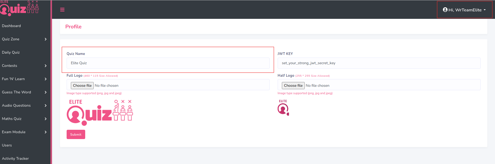

## Changing Application Logo

To change logo, favicon, Firebase, footer data, quizplay images, etc:

1. Go to Admin Panel -> Web Settings -> Settings

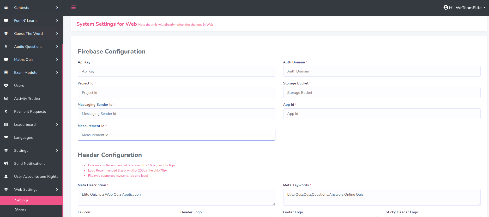

### Setting SEO Meta Tags

1. Go to .env file to configure SEO meta tags

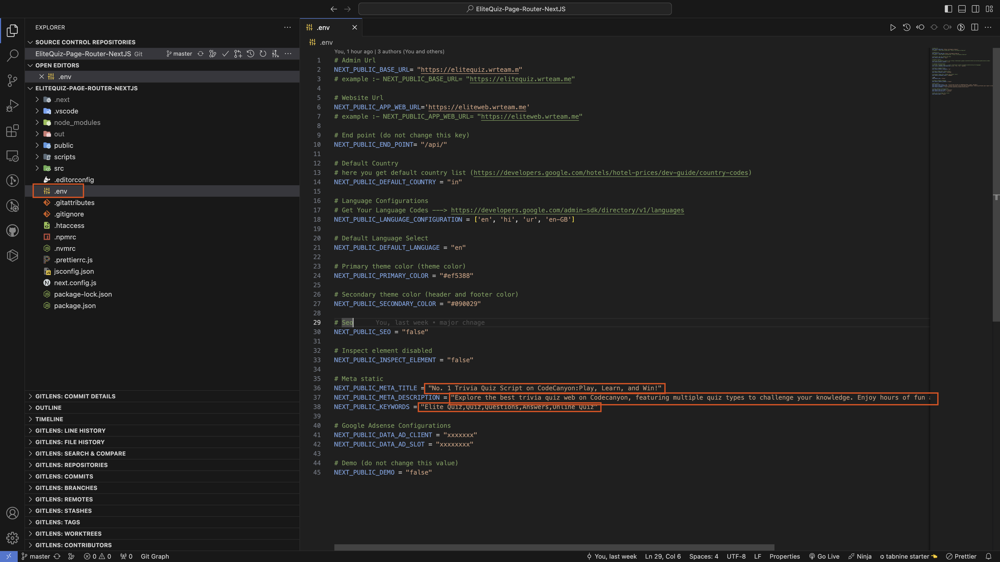

### Changing Favicon Icon

Note: Please set your favicon icon as `favicon.ico` name and format is only ico set. You can use this tool to convert image to ico: [Favicon Generator](https://www.favicon-generator.org/)

1. Go to public folder -> favicon.ico

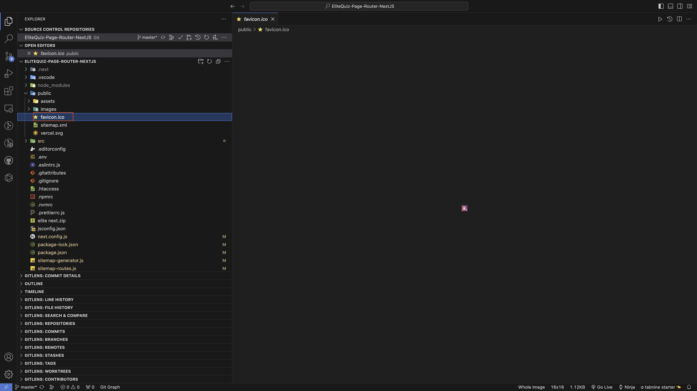

## Changing Application Colors

To change the application colors:

1. Add your colors in Admin Panel -> Web Settings -> Settings

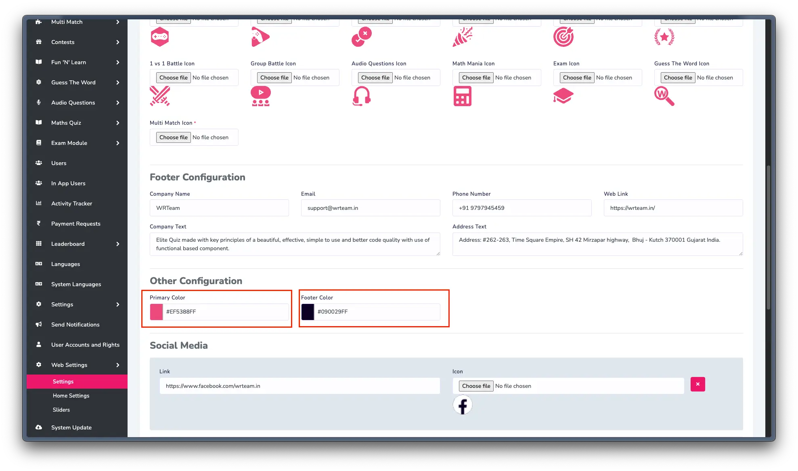

## Changing Application Font

To change the application font:

1. Go to YOUR_APP_FOLDER/src/style/global.css and add your font as shown in the image
2. You can get fonts from [Google Fonts](https://fonts.google.com/)

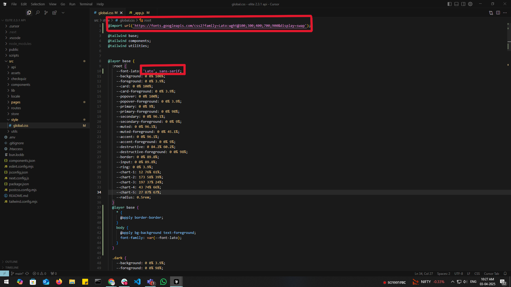

## Adding Slider on Homepage

To add or modify sliders on the homepage:

1. Go to admin panel -> web settings -> slider

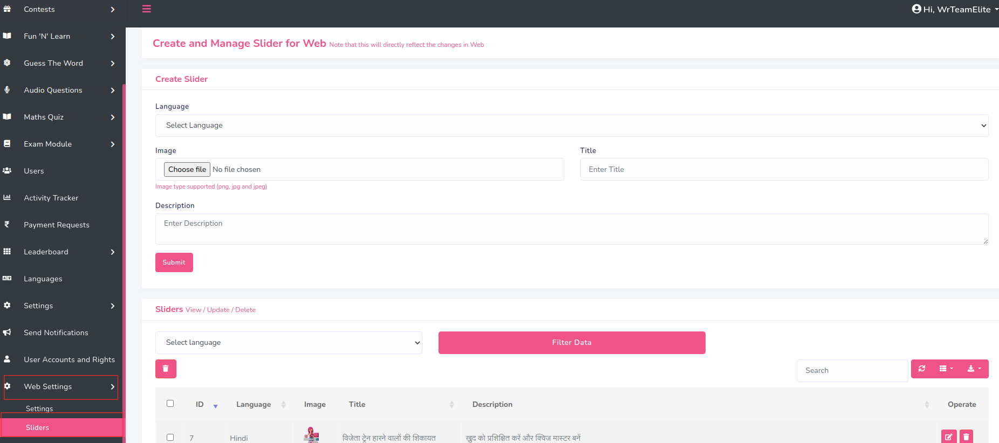

## Adding Badge Images

To add or modify badge images:

1. Go to admin panel -> Settings -> Badges Settings

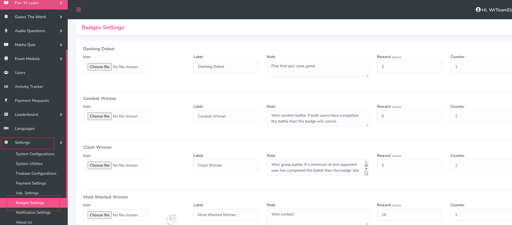

## RTL Support (Right-to-Left)

To enable RTL support for languages like Arabic or Hebrew:

1. Go to Admin Panel -> System Languages

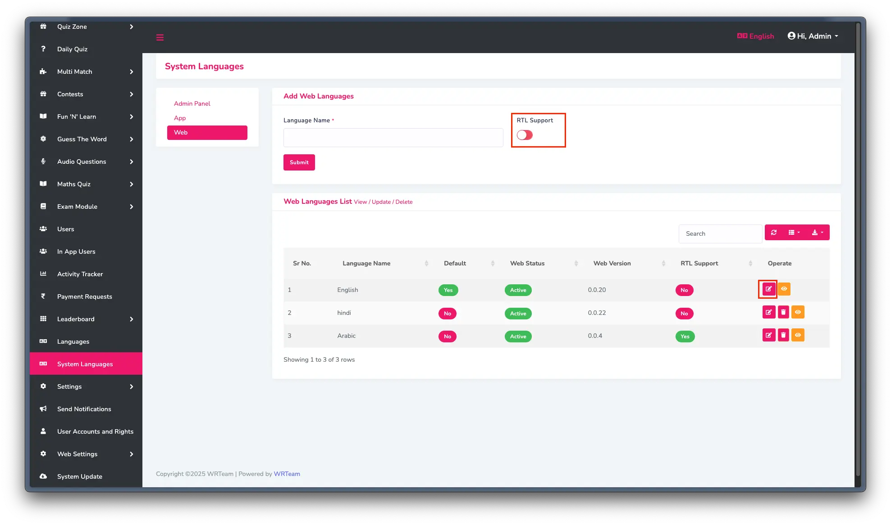

## Setting Domain URL

To set the Domain URL:

1. Go to .env file

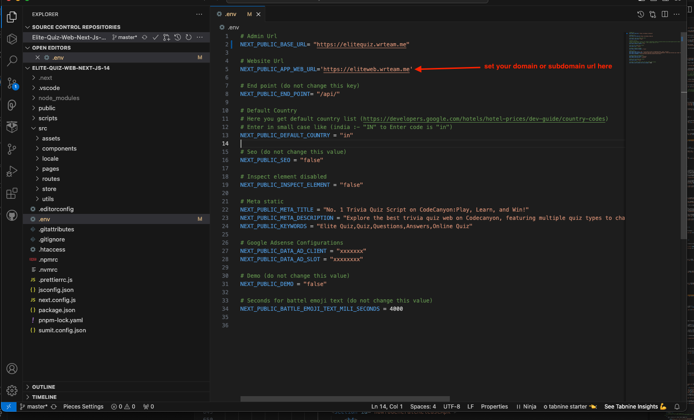

## Configuring Sitemap

To configure the sitemap for better SEO:

1. First set domain web url in .env file
2. Second open terminal and run command: `npm run dev`
3. Go to public -> sitemap.xml

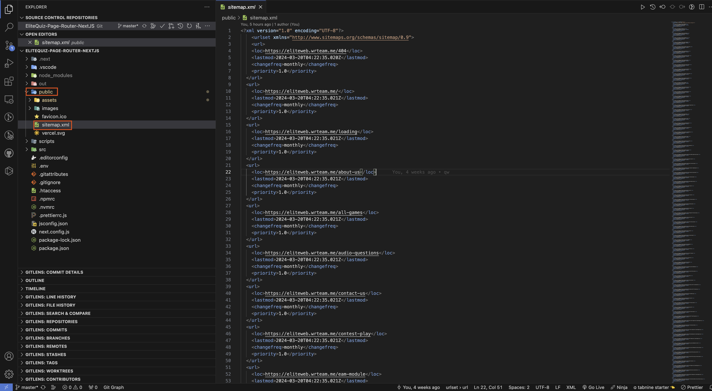

## Changing Timer Settings

To adjust the timer and other features settings:

1. Go to Admin Panel -> Settings -> System Utilities

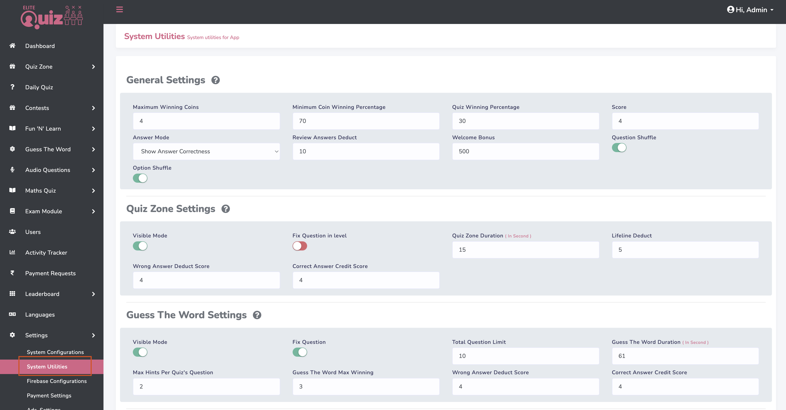

## Disabling Home Sections

To disable specific sections on the homepage:

1. Go to Admin Panel -> Web Settings -> Home Settings

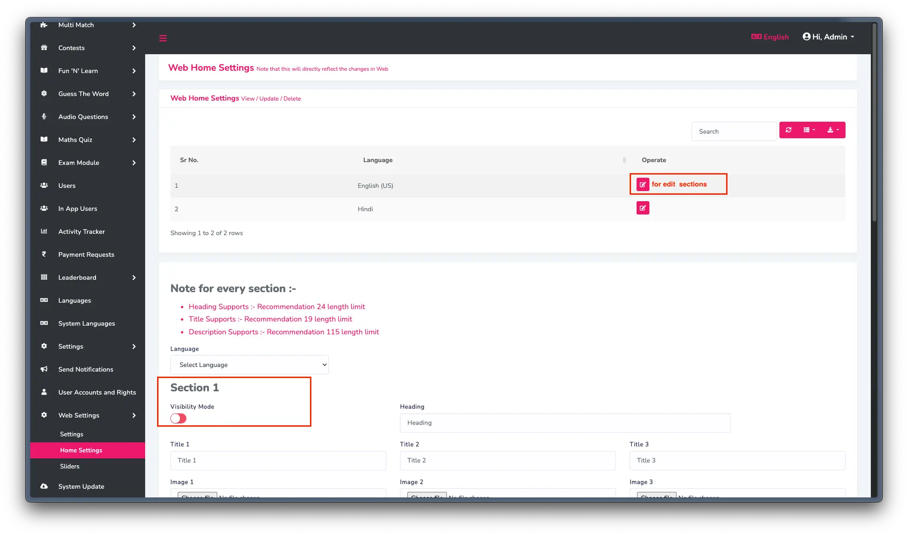

## Score Configuration

To configure scoring:

1. Go to Admin Panel -> Settings -> System Utilities

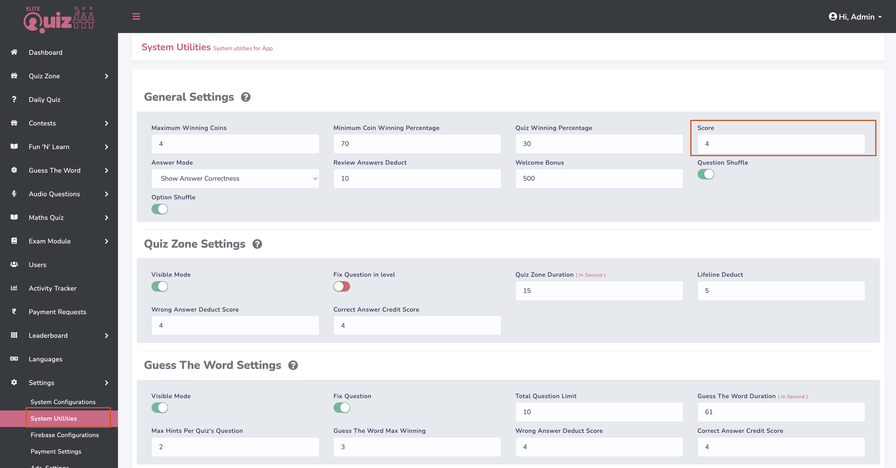

## Adding Google AdSense

To add Google AdSense to your application:

1. Go to [Google AdSense](https://adsense.google.com) and sign in to your account
2. Add your site as shown in the image

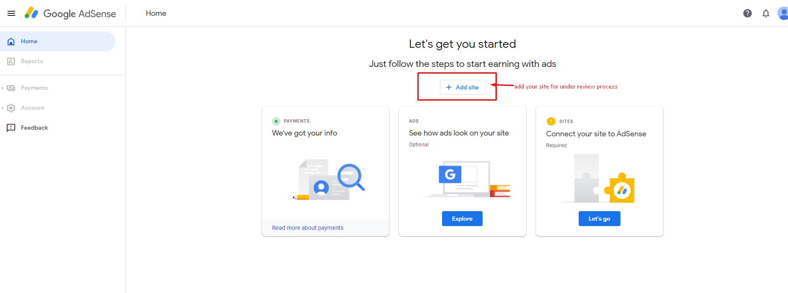

3. Click on "Let's Go" button

4. Copy the script code and paste it to your src -> pages -> \_document.js

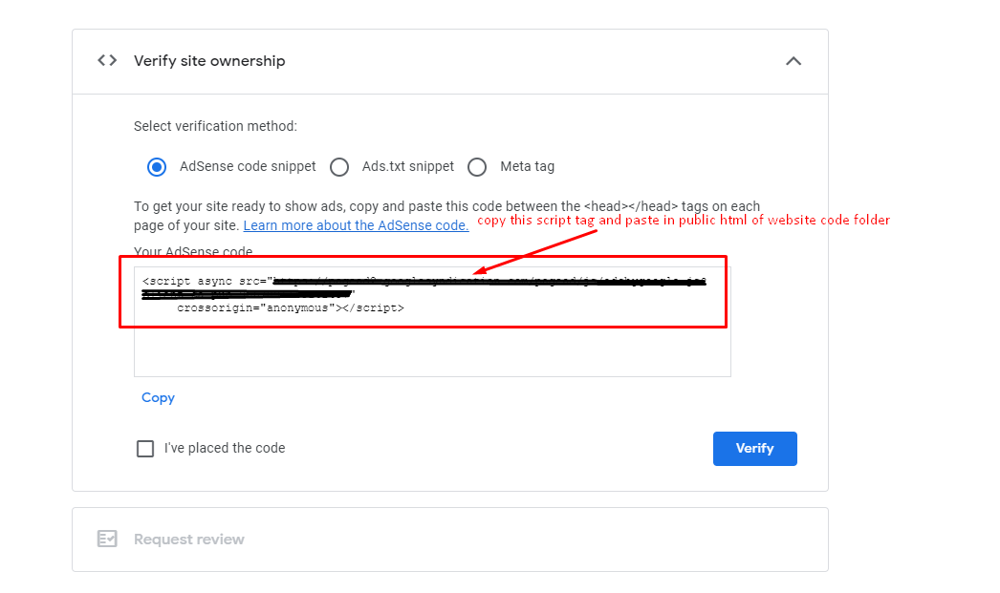
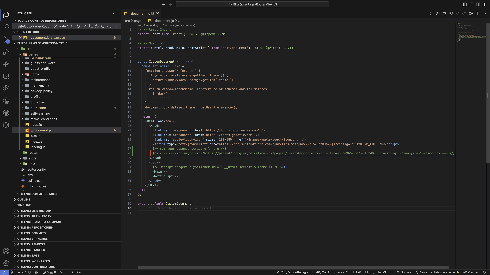

5. After adding the script, run the command for build folder: `npm run export` and upload to your server
6. After uploading, click on verify button in Google AdSense

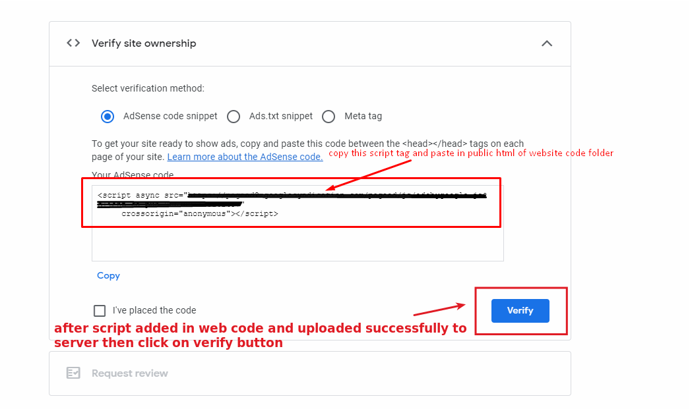

7. If it says "Getting ready…," your account is still under review and your site will not display ads until it has been approved

