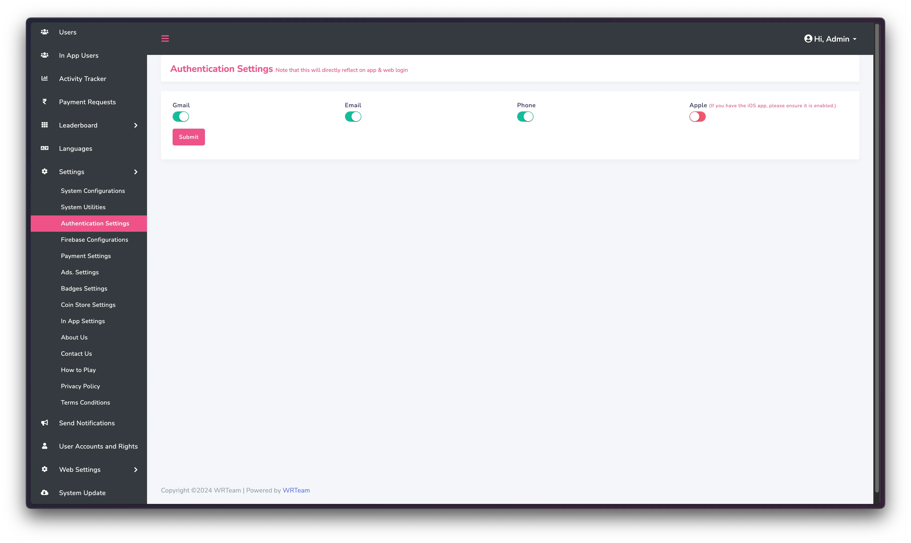
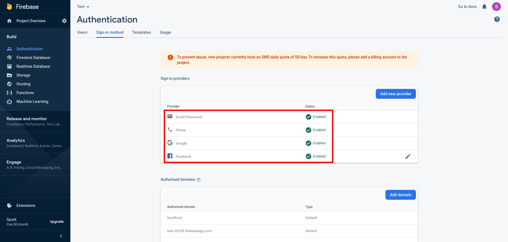
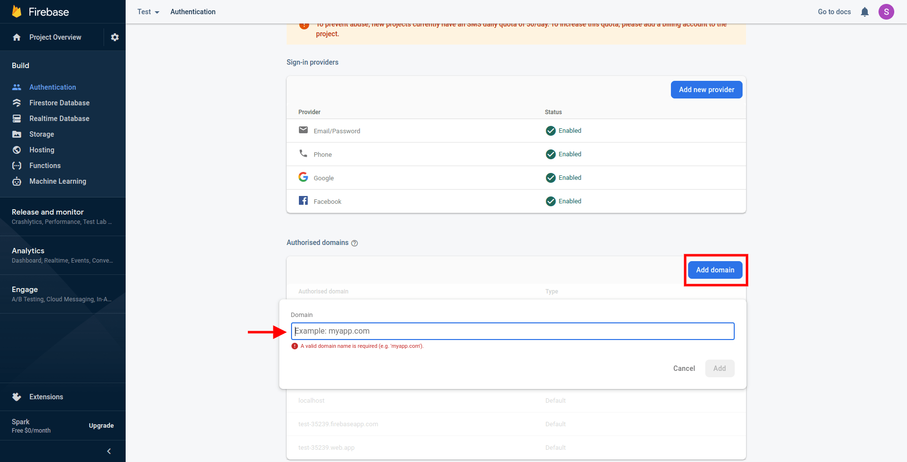
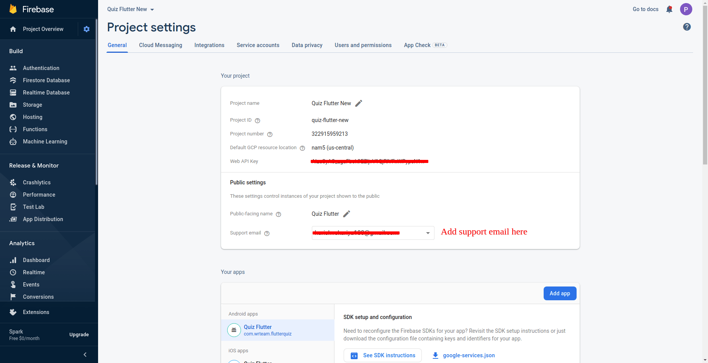

# Firebase Authentication

## How to Enable Firebase Auth

:::info New Feature
You can toggle authentication methods from admin panel now. Go to **Settings -> Authentication Settings**
:::

Authentication Methods should be enabled in both Panel and the firebase to work properly.

1. Go to your firebase project
2. Click on Authentication menu and go to sign-in method
3. Enable all the authentication methods shown in the image below:

   

4. After that add your domain name without https:// OR http://
   e.g **elitequiz.wrteam.in**

   

5. Please add support email as shown in below image. Go to project settings -> general -> public settings

   

## Supported Authentication Methods

Elite Quiz supports multiple authentication methods:

- Email/Password
- Google Sign-In
- Phone Number

## Troubleshooting Authentication Issues

If users are having trouble logging in, check the following:

1. Ensure the authentication methods are enabled in both Firebase console and admin panel
2. Verify Firebase configuration is correct in the app
3. Check if the authorized domains are properly configured in Firebase
4. Look for any errors in the browser console
