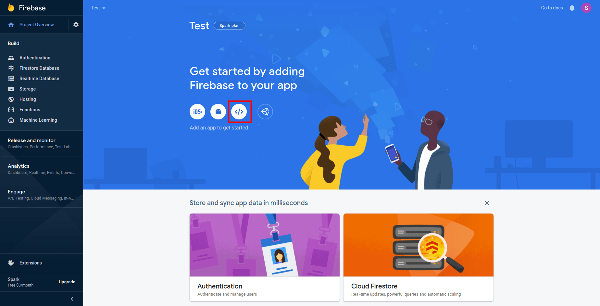
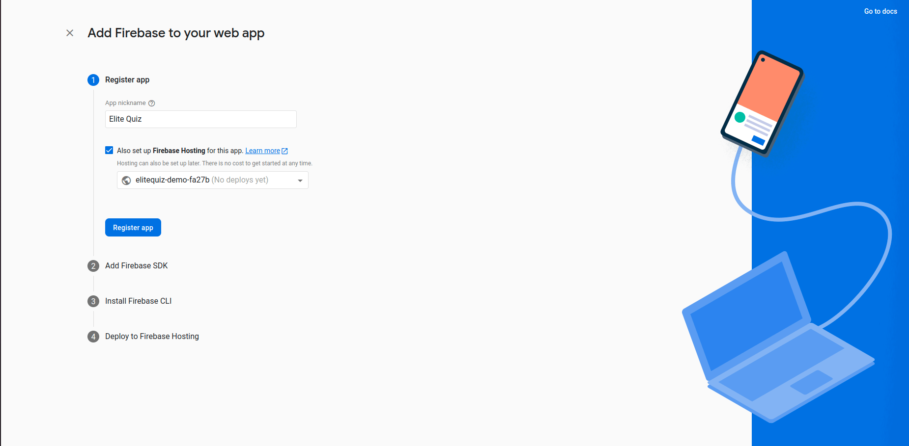
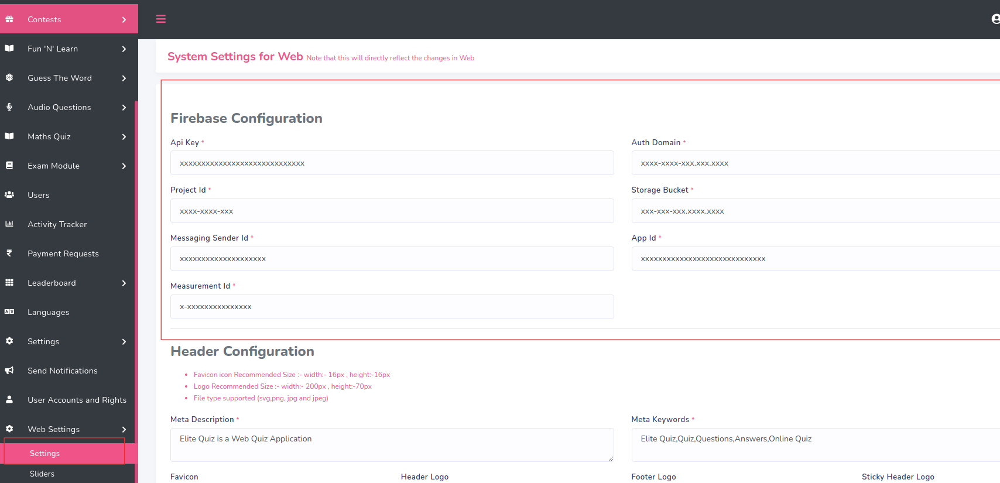

# Firebase Integration

:::note
If you already have purchased the App version of Elite Quiz and already created a firebase project, then you can skip the first step.
:::

## How to Configure Firebase

1. Create a firebase project in your account:

   
   
   
   

2. Add web application to your firebase project:

   

3. Enter the App Name and Click on Register App:

   

4. Configure firebase integration and domain in firebase console:

   

5. Copy the highlighted code and paste one by one as per labels given in admin panel -> web settings -> settings:

   

6. This credentials should match with the credentials that you have set in admin panel. Otherwise it will not work properly:

   

7. Configure domain in firebase console:

   

8. You have successfully connected your Web application to your firebase project.

## Why Firebase Is Important

Firebase provides authentication, real-time database, and cloud functions that are essential for the Elite Quiz app to function properly. The setup ensures users can log in, data is synced, and the application runs smoothly.
