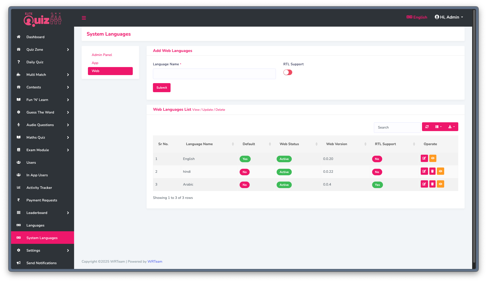
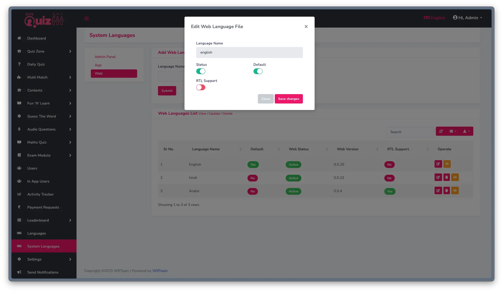
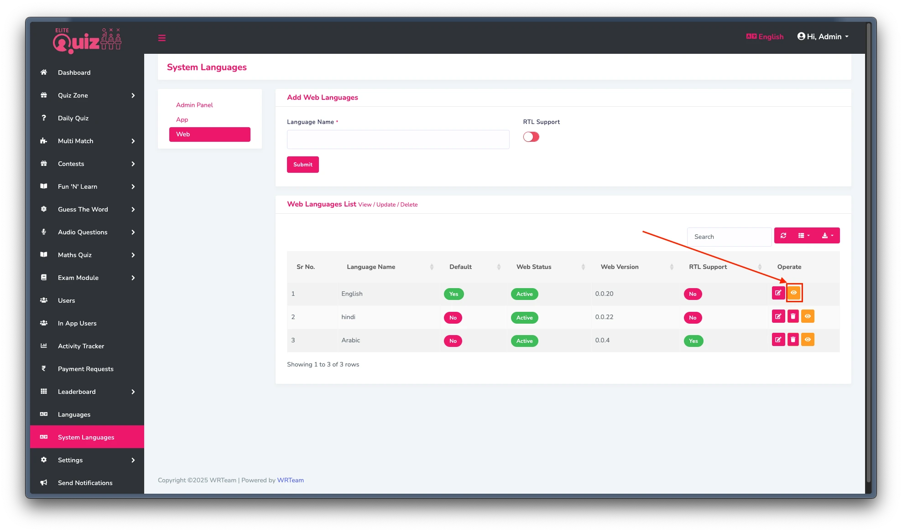
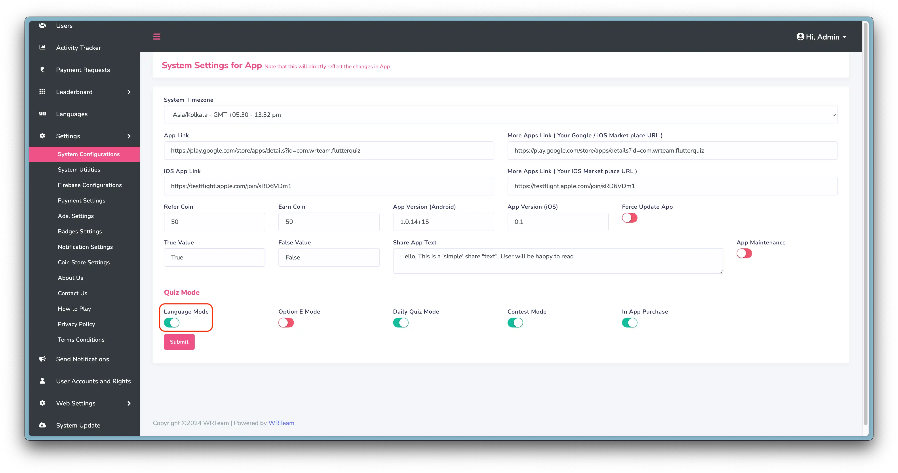
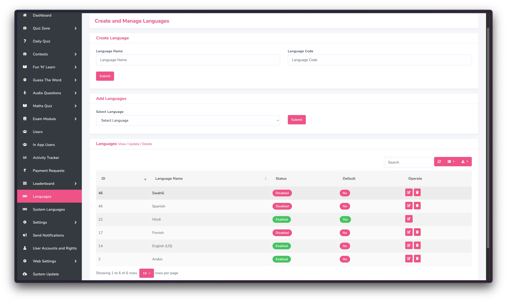

# Managing Languages

Elite Quiz provides robust multilingual support. This page explains how to manage and customize languages in the application.

## Manage System Languages (Translations)

To manage and add system translations, you can go to System Languages setting:

To make a language the default, you can edit the language. When a user opens the app for the first time, the default language will be selected. After that, users can select any other available language.

## How to change the web language labels

To manage and add system translations, you can go to System Languages and select the web and click on eye icon:

## Manage Quiz Language

Quiz Language refers to the language of the questions and quiz content, not the translations or labels of the app. If you want to have content in multiple languages, this feature will be useful for you.

1. If you want to have multiple languages for the quiz content, enable language mode in your admin panel as shown in the image below. Otherwise, keep it disabled.

   

2. Then you can Add/Manage quiz languages from the Languages Section. Skip this step if language mode is disabled.

   

## RTL Support

For languages that read from right to left (like Arabic or Hebrew), you can enable RTL support:

1. Go to Admin Panel -> System Languages
2. Edit the language you want to set as RTL
3. Toggle the RTL option to enable it

## Front-end Language Switching

Users can switch languages on the front-end by:

1. Clicking on the language selector in the header
2. Selecting their preferred language from the dropdown

The language preference is saved for each user, so they'll see the app in their chosen language on subsequent visits.
